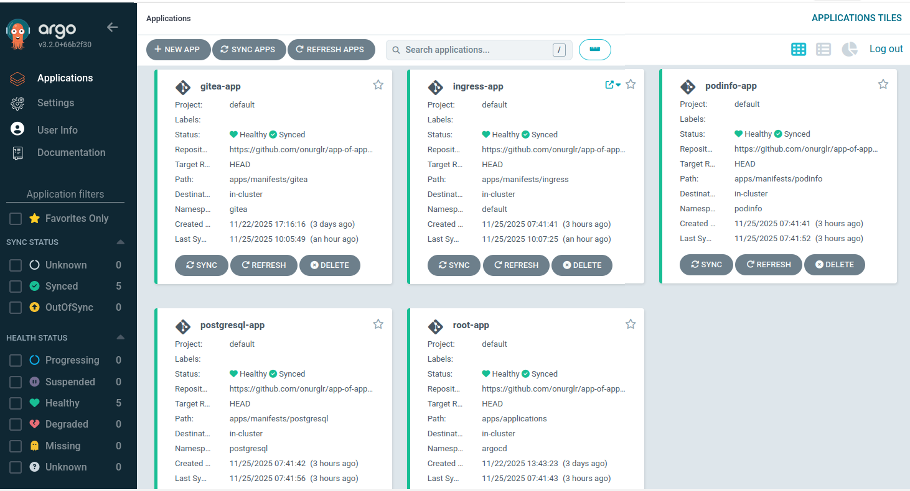
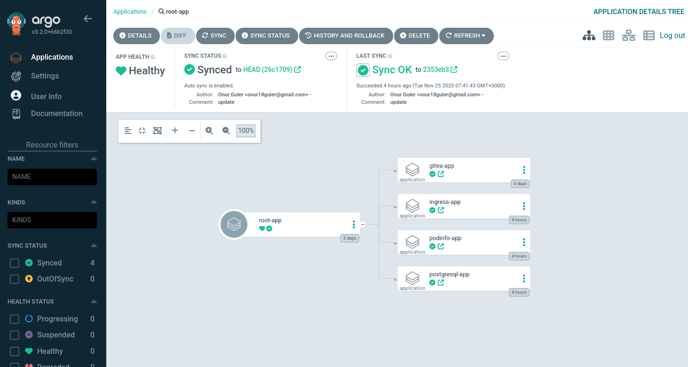
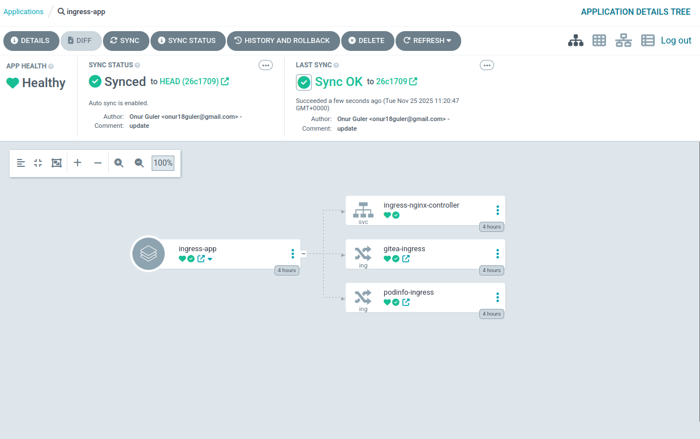
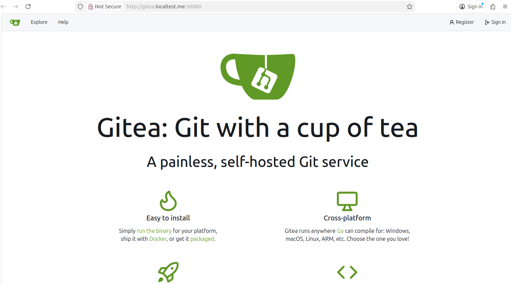
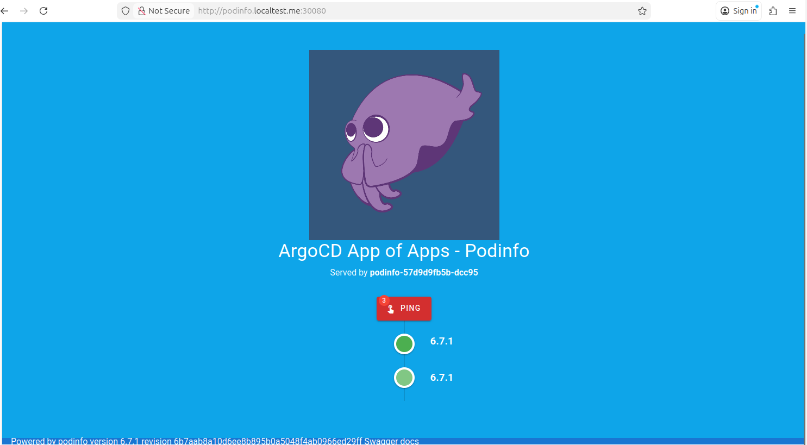

# App of Apps - ArgoCD

A simple ArgoCD App of Apps pattern example: Gitea + PostgreSQL stack with Ingress.

## 🏗️ Architecture

This project demonstrates the **App of Apps** pattern with a production-ready setup:

```
┌─────────────────────────────────────┐
│      Root Application              │
│    (root-application.yaml)         │
└──────────────┬──────────────────────┘
               │
       ┌───────┴────────┐
       │                │
┌──────▼──────┐  ┌──────▼──────────┐
│ PostgreSQL  │  │     Gitea       │
│   (DB)      │  │  (Git Server)   │
└─────────────┘  └──────┬──────────┘
                        │
                   ┌────▼──────┐
                   │  Ingress  │
                   │ (Routing) │
                   └───────────┘
```

ArgoCD surfaces each child application separately so you can inspect sync status per stack component.  


The **root application** (`root-application.yaml`) is the single manifest you apply manually. It tracks the `apps/applications/` directory and instructs ArgoCD to create four child applications: PostgreSQL, Gitea, Podinfo, and Ingress. The root view in ArgoCD looks like this:



Each child application points to a different folder under `apps/manifests/`, which keeps infrastructure concerns isolated while still enabling a single "bootstrap" command. This is the essence of the App of Apps pattern: **one manifest to rule many applications**.

### Why App of Apps?
- Bootstrap with a single command (`kubectl apply -f root-application.yaml`)
- Delegate ownership: each manifest folder can evolve independently
- Consistent ArgoCD RBAC/auditing per application
- Easier rollbacks: you can roll back the root app or only one child app

### Why Ingress with subdomains?
- Clean URLs (`gitea.localtest.me`, `podinfo.localtest.me`) even on localhost
- Path isolation: each ingress object enforces its own routing rules
- Works with the same NodePort by relying on host headers

## 📦 Applications

### PostgreSQL
- **Namespace:** `postgresql`
- **Purpose:** Database for Gitea
- **Port:** 5432 (ClusterIP - internal only)
- **Storage:** PersistentVolumeClaim (5Gi) - data persists across pod restarts

### Gitea
- **Namespace:** `gitea`
- **Purpose:** Git hosting service
- **Port:** 3000 (HTTP) - Accessible via Ingress (NodePort 30080)
- **Ingress Host:** `gitea.localtest.me`
- **SSH Port:** 22
- **Dependency:** PostgreSQL (waits via init container)
- **Storage:** PersistentVolumeClaim (10Gi) - repositories and config persist across pod restarts
- **First-time Setup:** When accessing Gitea for the first time, you'll see a setup page. Use these database credentials:
  - **Database Type:** `PostgreSQL`
  - **Host:** `postgresql.postgresql.svc.cluster.local:5432` (⚠️ not `localhost:3306`)
  - **Username:** `gitea`
  - **Password:** `gitea`
  - **Database Name:** `gitea`

### Podinfo
- **Namespace:** `podinfo`
- **Purpose:** Demo web application (health, UI, metrics)
- **Port:** 80 (ClusterIP) - Accessible via Ingress (NodePort 30080)
- **Ingress Host:** `podinfo.localtest.me`
- **Dependency:** None (stateless)

### Ingress
- **Namespace:** `gitea`
- **Purpose:** Route HTTP traffic to app services via subdomains
- **Access:** `http://gitea.localtest.me:30080` and `http://podinfo.localtest.me:30080`
- **Having issues?** Check the [Troubleshooting Guide](#common-issues)

Ingress resources are grouped under a dedicated `ingress-app` so ArgoCD can manage the controller service plus the individual ingress objects together. This view makes it obvious that:
- `ingress-nginx-controller` (svc) exposes the NodePort.
- `gitea-ingress` and `podinfo-ingress` are separate resources, each pointing at different services but managed as one logical unit.



## 🚀 Quick Start

### Prerequisites
- Kubernetes cluster
- ArgoCD installed
- `kubectl` configured

### Installation

#### Step 1: Install Ingress Controller (One-time Manual Step)

The Ingress Controller is a cluster-level component that needs to be installed once:

```bash
kubectl apply -f https://raw.githubusercontent.com/kubernetes/ingress-nginx/main/deploy/static/provider/cloud/deploy.yaml
```

**Why manual?**
- Ingress Controller is a cluster-level component
- Installed once, rarely changes
- Shared by all applications

Wait for the controller to be ready:
```bash
kubectl wait --namespace ingress-nginx \
  --for=condition=ready pod \
  --selector=app.kubernetes.io/component=controller \
  --timeout=300s
```

#### Step 2: Configure Ingress Controller Service (For Local Access)

Configure the Ingress Controller service to use NodePort for local access:

```bash
kubectl edit svc ingress-nginx-controller -n ingress-nginx
```

Change:
```yaml
type: LoadBalancer  →  type: NodePort
```

Add to ports section (any NodePort in the valid 30000–32767 range works; example below uses 30080):
```yaml
ports:
- port: 80
  targetPort: 80
  nodePort: 30080  # ← Add this
  protocol: TCP
  name: http
```

#### Step 3: Apply Root Application

```bash
kubectl apply -f root-application.yaml
```

#### Step 4: Configure GitHub Webhook (Optional - For Instant Sync)

By default, ArgoCD polls the Git repository every 3 minutes. For instant synchronization when you push changes, configure a GitHub webhook:

**Get ArgoCD Webhook URL:**
```bash
# Get ArgoCD server URL
kubectl get svc -n argocd argocd-server

# If using port-forward:
kubectl port-forward -n argocd svc/argocd-server 8080:443

# Webhook URL will be:
# http://localhost:8080/api/webhook (for local)
# https://your-argocd-domain/api/webhook (for production)
```

**Add Webhook in GitHub:**
1. Go to your repository: `https://github.com/onurglr/app-of-apps-argocd`
2. Settings → Webhooks → Add webhook
3. **Payload URL:** `https://your-argocd-domain/api/webhook` (or `http://localhost:8080/api/webhook` if using port-forward)
4. **Content type:** `application/json`
5. **Events:** Select "Just the push event"
6. **Active:** ✓
7. Click "Add webhook"

**Alternative: Manual Refresh**
If webhook is not configured, ArgoCD will automatically detect changes within 3 minutes. You can also manually refresh:
- In ArgoCD UI: Click "REFRESH" button on the application
- Via CLI: `argocd app get root-app --refresh`

**ArgoCD will automatically:**
- ✅ Create all child applications
- ✅ Deploy PostgreSQL
- ✅ Deploy Gitea (after PostgreSQL is ready)
- ✅ Deploy Ingress resources
- ✅ Handle dependencies via init containers
- ✅ Create all necessary namespaces

#### Step 4: Configure GitHub Webhook (Optional - For Instant Sync)

By default, ArgoCD polls the Git repository every 3 minutes. For instant synchronization when you push changes, configure a GitHub webhook:

**Get ArgoCD Webhook URL:**
```bash
# Get ArgoCD server URL
kubectl get svc -n argocd argocd-server

# If using port-forward:
kubectl port-forward -n argocd svc/argocd-server 8080:443

# Webhook URL will be:
# http://localhost:8080/api/webhook (for local)
# https://your-argocd-domain/api/webhook (for production)
```

**Add Webhook in GitHub:**
1. Go to your repository: `https://github.com/onurglr/app-of-apps-argocd`
2. Settings → Webhooks → Add webhook
3. **Payload URL:** `https://your-argocd-domain/api/webhook` (or `http://localhost:8080/api/webhook` if using port-forward)
4. **Content type:** `application/json`
5. **Events:** Select "Just the push event"
6. **Active:** ✓
7. Click "Add webhook"

**Alternative: Manual Refresh**
If webhook is not configured, ArgoCD will automatically detect changes within 3 minutes. You can also manually refresh:
- In ArgoCD UI: Click "REFRESH" button on the application
- Via CLI: `argocd app get root-app --refresh`

#### Step 5: Verify Installation

```bash
# Check applications
kubectl get applications -n argocd

# Check pods
kubectl get pods -n postgresql
kubectl get pods -n gitea

# Check ingress
kubectl get ingress -n gitea

# Check ingress controller
kubectl get pods -n ingress-nginx
```

#### Step 6: Access the apps

`localtest.me` automatically resolves to `127.0.0.1`, so you normally do not need to edit `/etc/hosts`.  
If you are running on minikube/kind and NodePort is exposed on the node IP (e.g., `192.168.49.2`), add that IP to `/etc/hosts` instead.

- **Gitea Web UI:** `http://gitea.localtest.me:30080`
- **Podinfo UI:** `http://podinfo.localtest.me:30080`
- **First-time Gitea setup:** When you first access Gitea, you'll see a setup page. Enter:
  - **Database Host:** `postgresql.postgresql.svc.cluster.local:5432` (⚠️ use port 5432, not 3306)
  - **Username:** `gitea`, **Password:** `gitea`, **Database Name:** `gitea`
  - After setup, create your admin user

> Ingress rewrites the host header, so her application feels like its own subdomain even though everything runs locally:

| Gitea via Ingress | Podinfo via Ingress |
| ----------------- | ------------------- |
|  |  |

## 📁 Project Structure

```
app-of-apps-argocd/
├── root-application.yaml           # Root app - manually applied
├── apps/
│   ├── applications/               # Child ArgoCD Applications
│   │   ├── postgresql-app.yml
│   │   ├── gitea-app.yml
│   │   └── ingress-app.yml
│   │
│   └── manifests/                  # Kubernetes manifests
│       ├── postgresql/
│       │   ├── deployment.yml
│       │   ├── service.yml
│       │   └── configmap.yml
│       ├── gitea/
│       │   ├── deployment.yml
│       │   ├── service.yml
│       │   └── configmap.yml
│       ├── podinfo/
│       │   ├── deployment.yml
│       │   └── service.yml
│       └── ingress/
│           ├── gitea-ingress.yml
│           └── podinfo-ingress.yml
```

## 🔍 Features

### App of Apps Pattern
- **Root Application** manages all child applications
- Each child application is independent but coordinated
- Automated sync (`prune` and `selfHeal` enabled)

### Dependency Management
- **Gitea** waits for PostgreSQL via init container
- Service discovery for automatic connection

### Ingress Integration
- **Ingress** routes traffic to Gitea
- Clean URLs via Ingress Controller
- Ready for SSL/TLS configuration

### Simple and Understandable
- Minimal configuration
- Easy to get started
- Adaptable for production

## 🛠️ Verification

### Check Applications
```bash
# List all ArgoCD applications
kubectl get applications -n argocd

# Check specific application
kubectl get application postgresql-app -n argocd
kubectl get application gitea-app -n argocd
kubectl get application ingress-app -n argocd

# View application status
kubectl describe application gitea-app -n argocd
```

### Check Pods
```bash
# PostgreSQL
kubectl get pods -n postgresql
kubectl logs -n postgresql -l app=postgresql

# Gitea
kubectl get pods -n gitea
kubectl logs -n gitea -l app=gitea

# Podinfo
kubectl get pods -n podinfo
kubectl logs -n podinfo -l app=podinfo

# Ingress Controller
kubectl get pods -n ingress-nginx
```

### Check Services
```bash
# PostgreSQL service
kubectl get svc -n postgresql

# Gitea service
kubectl get svc -n gitea

# Podinfo service
kubectl get svc -n podinfo

# Ingress Controller service
kubectl get svc -n ingress-nginx
```

### Check Ingress
```bash
# Ingress resources
kubectl get ingress --all-namespaces

# Detailed ingress info
kubectl describe ingress gitea-ingress -n gitea
kubectl describe ingress podinfo-ingress -n podinfo
```

## 🔧 Troubleshooting

### PersistentVolume Issues

If PVCs are not binding (stuck in `Pending` state), check your cluster's storage class:

```bash
# Check available storage classes
kubectl get storageclass

# If using minikube, default is usually "standard" or "hostpath"
# Update PVC files if needed:
# apps/manifests/postgresql/pvc.yml
# apps/manifests/gitea/pvc.yml
```

**Note:** After adding PVCs, Gitea setup will persist across pod restarts. You only need to configure it once!

### Gitea not accessible
```bash
# Check Gitea pod
kubectl get pods -n gitea
kubectl logs -n gitea -l app=gitea

# Check service
kubectl get svc -n gitea

# Check ingress
kubectl get ingress -n gitea
kubectl describe ingress gitea-ingress -n gitea

# Check ingress controller
kubectl get pods -n ingress-nginx
kubectl logs -n ingress-nginx -l app.kubernetes.io/name=ingress-nginx
```

### Database connection issues
```bash
# Check PostgreSQL pod
kubectl get pods -n postgresql
kubectl logs -n postgresql -l app=postgresql

# Test connection
kubectl exec -it -n postgresql <postgresql-pod> -- psql -U gitea -d gitea
```

### Init container waiting
### Podinfo not accessible
```bash
# Check Podinfo pod
kubectl get pods -n podinfo
kubectl logs -n podinfo -l app=podinfo

# Check Podinfo ingress
kubectl describe ingress podinfo-ingress -n podinfo
```

```bash
# Check Gitea init container logs
kubectl logs -n gitea <gitea-pod> -c wait-for-postgres

# Verify PostgreSQL is ready
kubectl get pods -n postgresql
```

### Ingress Controller not working
```bash
# Check if Ingress Controller is installed
kubectl get pods -n ingress-nginx

# If not installed, run Step 1 from Quick Start

# Check Ingress Controller logs
kubectl logs -n ingress-nginx -l app.kubernetes.io/name=ingress-nginx

# Check Ingress Controller service
kubectl get svc -n ingress-nginx
```

### Applications not syncing
```bash
# Check ArgoCD applications
kubectl get applications -n argocd

# Check application details
kubectl describe application gitea-app -n argocd

# Check ArgoCD server logs
kubectl logs -n argocd -l app.kubernetes.io/name=argocd-server
```

## 📚 Learning Points

This project demonstrates:
- ✅ ArgoCD App of Apps pattern
- ✅ Inter-application dependency management
- ✅ Init container for dependency waiting
- ✅ Kubernetes service discovery
- ✅ Managing multiple applications (PostgreSQL, Gitea, Podinfo) with a single root app
- ✅ Ingress for external access
- ✅ Simple and understandable structure

## Common Issues

### 1. `nodePort` out of range (3000)
**Symptoms**
- ArgoCD sync fails with `Invalid value: 3000; valid range 30000-32767`

**Fix**
- Update `apps/manifests/ingress/ingress-controller-service.yml` so `nodePort` values are within `30000-32767` (e.g., `30080` and `30443`)
- Re-sync ArgoCD

### 2. `nodePort` already allocated
**Symptoms**
- ArgoCD sync fails with `provided port is already allocated`

**Fix**
- Pick a different `nodePort` value (still within `30000-32767`) in both the manifest and the live service (`kubectl edit svc ingress-nginx-controller -n ingress-nginx`)

### 3. Cannot reach `*.localtest.me:30080`
**Symptoms**
- Browser/curl shows connection errors even though ingress is synced

**Fix**
- NodePort listens on the Kubernetes node IP, not 127.0.0.1. Add the node IP to `/etc/hosts`, e.g.:
  ```
  192.168.49.2 gitea.localtest.me podinfo.localtest.me
  ```
- If you prefer using `localtest.me` without hosts edit, ensure your environment resolves it to the node IP (minikube/kind usually needs manual hosts entry)
- After updating, verify with `ping gitea.localtest.me` and `curl -I http://gitea.localtest.me:30080`

## 🔐 Accessing PostgreSQL (Development)

PostgreSQL is only accessible from within the cluster. For external access during development:

### Option 1: Port Forward (Recommended)
```bash
kubectl port-forward -n postgresql svc/postgresql 5432:5432
# Access via: localhost:5432
```

### Option 2: NodePort (Not recommended for production)
Modify `apps/manifests/postgresql/service.yml` to use NodePort type.

**For production:** Use VPN/Private Network - database should remain internal.

## 📝 Summary

### Installation Steps:
1. **Install Ingress Controller** (manual, one-time) ← ONLY MANUAL STEP
2. **Apply root-application.yaml** (ArgoCD manages everything)
3. **Done!** 🎉

### What ArgoCD Manages:
- ✅ All applications (PostgreSQL, Gitea, Ingress)
- ✅ All namespaces
- ✅ All deployments and services
- ✅ Configuration via ConfigMaps
- ✅ Automatic synchronization

## 🤝 Contributing

1. Fork the repository
2. Create your feature branch
3. Commit your changes
4. Push to the branch
5. Open a Pull Request

## 📝 License

This project is for educational purposes.
